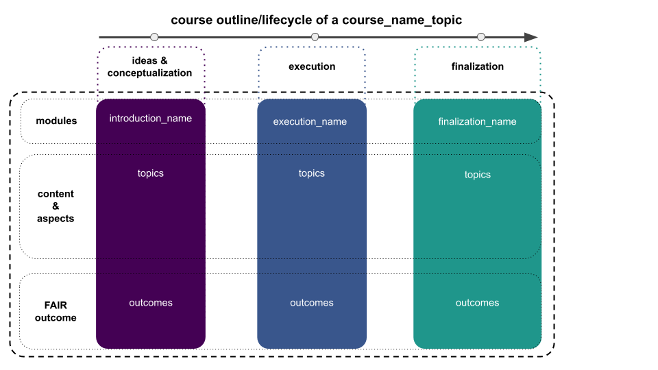

# General outline

Within this course we will course_description. To do so, we will follow a “learning by doing” approach in a tripartite manner. Starting from a [basic introduction  (Block I)](https://spark-csd.github.io/course_name/introduction/pages/introduction.html), we will [run actual experiments/analyzes (Block II)](https://spark-csd.github.io/course_name/experimentation/pages/experimentation.html) planned and conducted by you, as well as [communicate/present the obtained results (Block III)](https://spark-csd.github.io/course_name/finalization/pages/finalization.html). Thus, we actively seek out realistic examples and workflows that mimic the lifecycle of real-world projects, trying to present you with both a respective overview and hands-on experience. 

You can find the course_outline_graphic_template [here](https://docs.google.com/presentation/d/1BaAwOW_54DFVxnyTL6qoIaTzegObnsDIfpr7OKHurio/edit?usp=sharing). Simply create a copy via "Make a copy", adapt it to your needs and download it, placing it in the "course_name_repository/course/static/course_graphics/" directory and name it "course_outline.png". 

### When and where do we meet?

As this won't be a "classic" course that entails weekly lectures/assignments, etc. but instead utilizes a different outline that is oriented along the research process, we will have sessions with varying content (situated within three main blocks: [introduction/background](https://spark-csd.github.io/course_name/introduction/pages/introduction.html), [project execution](https://spark-csd.github.io/course_name/experimentation/pages/experimentation.html), [project finalization](https://spark-csd.github.io/course_name/finalization/pages/finalization.html)) every now and then. Combined with a strong focus on project work and direct supervision, we will organize meetings as we go with all participants. Thus, please watch out for E-Mails/Discord notifications!  

The in-person meetings will take place in [location_name](location_link)!

<iframe width="425" height="350" frameborder="0" scrolling="no" marginheight="0" marginwidth="0" src="open_street_map_link" style="border: 1px solid black"></iframe> <small><a href="open_street_map_link">View Larger Map</a></small>

### Schedule

Please see below for our current _optimistic_ schedule. Depending on our progress, potential problems and different forms of learning, content and times might change a bit. Each lecture will be divided into several parts separated by a 5-10 minute break and might constitute a transition from basic to advanced concepts, theoretic to practical sessions and individual to group work. The different parts are roughly indicated in the schedule below like this:

🗓 - important information on date & time  
💡 - input from the instructor  
👩🏽‍🏫👨🏻‍🏫 - instructor presents content  
🥼 - research project work  
🧑🏽‍💻🧑🏾‍💻 - work on demo data  
🧑🏿‍🔬👩🏻‍🔬 - work on own research project  
🖥️ - computational work outside course hours  
✍🏽 - writing outside course hours  
📖 - reading outside course hours  

Please click on a given topic either within the table below or the `ToC` on the left to get to the respective materials.

| Date (day/month/year) 🗓 | Topics 💡👩🏽‍🏫👨🏻‍🏫 | Project related work 🥼🧑🏿‍🔬👩🏻‍🔬 | Tasks for subsequent meeting 🖥️✍🏽📖 |
|-------------------------|---------------------|-------------------------------|------------------------------------|
| date_in_day/month/year  | topic_name - [topic_short_description](https://spark-csd.github.io/course_name/topic_link.html) | project_related_task           | tasks_next_meeting                |

You can also find the course calendar with all dates and events below.

<iframe src="course_calendar_link" style="border: 0" width="800" height="600" frameborder="0" scrolling="no"></iframe>